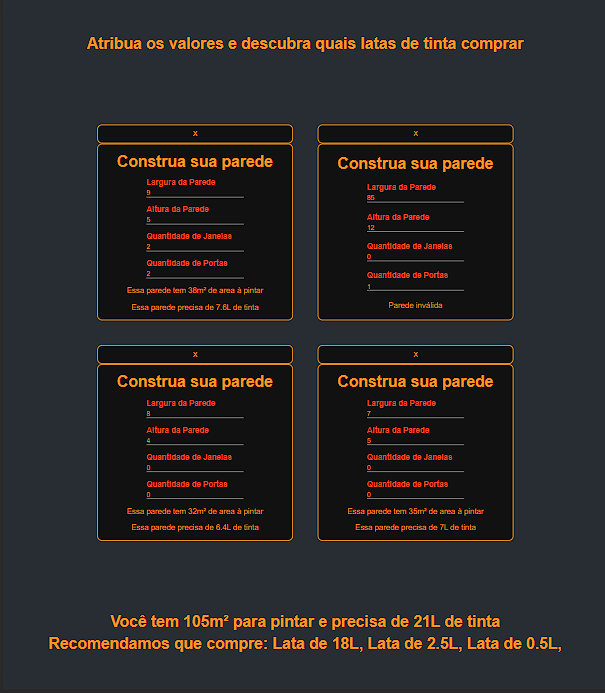

  

[Deploy](https://easy-paint.vercel.app/)

[Gitlab](https://gitlab.com/VMatiasDev1/easy-paint)

pt-BR

Aplicação desenvolvida para indicar quantas e quais latas de tinta comprar para pintar um cômodo. Havia algumas regras de negócio que invalidava uma parede.

en-US

An application developed to indicate how many and which paint cans to buy for painting a room. There were some business rules that invalidated a wall.
