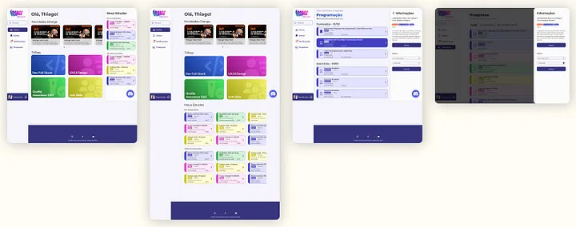
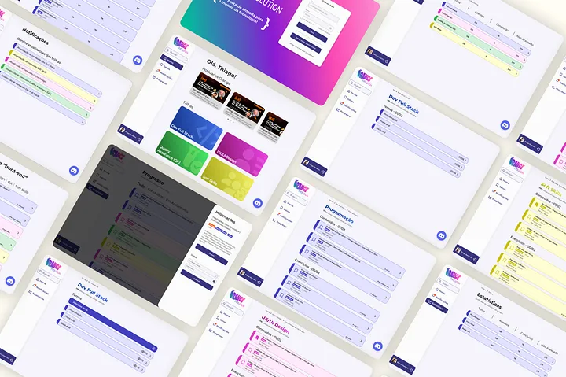

  
  

[Deploy](https://orangeevolution.netlify.app/)

[Github](https://github.com/Squad-15-FCamara)

pt-BR

Projeto desenvolvido durante um hackathon na última etapa do programa de formação da FCamara.

Dada a problemática, meu squad e eu começamos a criação do produto por meio de etapas de UX design.
Atuei na organização do gitflow e padroẽs de commits para meu time.
Desenvolvi junto com outros dois devs, o frontend da aplicação, fazendo toda a estilização, responsivdade, requisições e funcionalidades da aplicação.

Principais tecnologias: ReactJs, JavaScript, Styled-Components, Java, Spring, MySQL, Git, Github

en-US

Project developed during a hackathon in the last stage of fcamara's training program.

Given the problem, my squad and I started creating the product through UX design steps.
I worked in the organization of gitflow and conventional commit for my team.
I developed together with two other devs, the frontend of the application, doing all the stylization, responsiveness, requests and functionalities of the application

Main techs: ReactJs, JavaScript, Styled-Components, Java, Spring, MySQL, Git, Github
