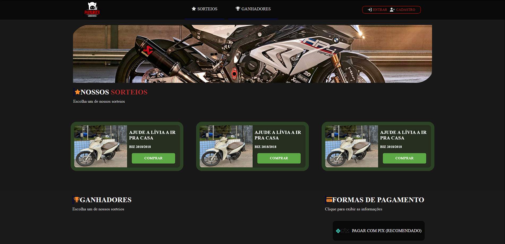
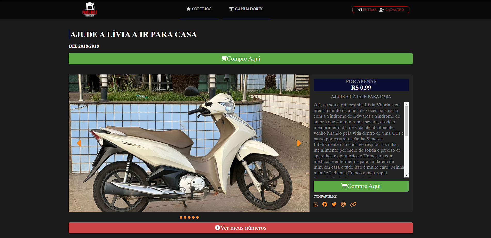

  
  

[Deploy](https://pigpremios.vercel.app/)

[Github](https://github.com/VMatiasDev/pigpremios)

pt-BR

Freelancer não finalizado de um site de rifa em que seria possível comprar cotas de diversos sorteios e acompanhar ganhadores anteriores

en-US

Unfinished freelancer work of a raffle website where it would be possible to purchase shares in various draws and track previous winners.
