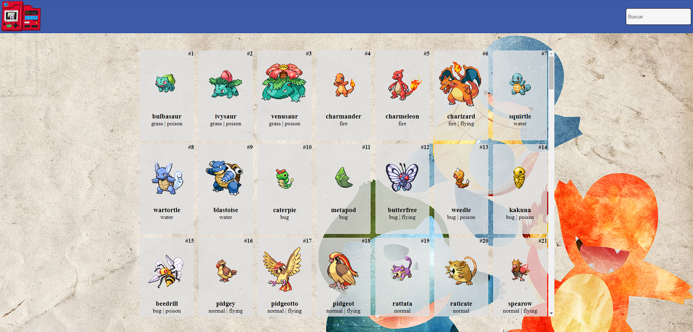

[Deploy](https://pokedex-v2-two.vercel.app/)

[Github](https://github.com/VMatiasDev/pokedex-v2)

pt-BR

Uma pokedex simples feita com React para praticar API

en-US

A simple pokedex made with React to practice API
