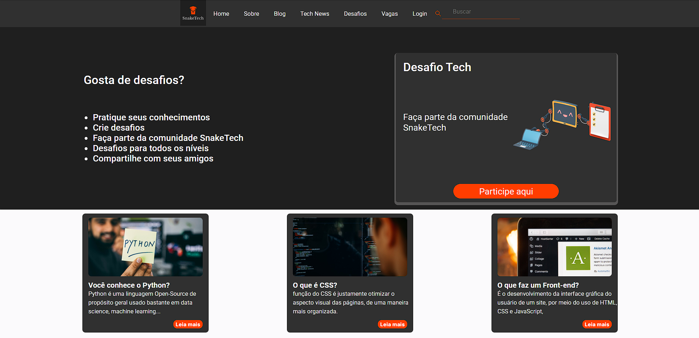

  

[Deploy](https://snaketech.netlify.app/)

[Github](https://github.com/SnakeTechProject/snaketech-frontend)

pt-BR

Atuei ativamente no desenvolvimento do site desde o levantamento dos requisitos até a entrega do mesmo. Seguimos boas práticas de código, de commits e tínhamos cultura de code review. Também utilizamos de scrum para definir tarefas.
Fui responsável por algumas configurações do sass, pela criação de alguns componentes usados e por parte da integração do back-end com o front-end

Principais tecnologias: React, JavaScript, Sass/Scss, Git, Github

en-US

I worked actively in the development of the site from the survey of the requirements to the delivery of the same. We followed good code practices, good commits practices and had the code review culture. We also use scrum to define tasks.
I was responsible for some sass configurations, the creation of some components used and the integration of the backend with the frontend

Main techs: React, JavaScript, Sass/Scss, Git, Github
